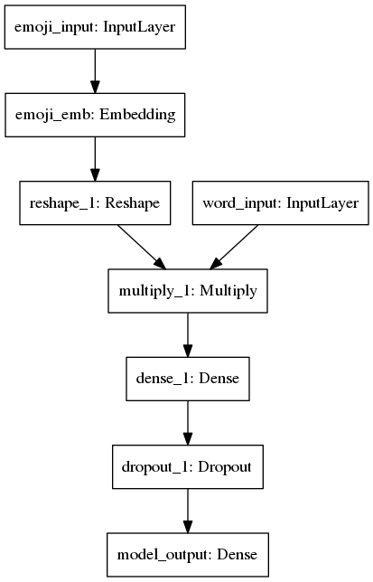
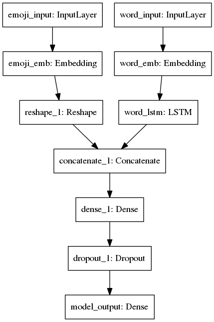

# emoji2vec

This is my attempt to train, visualize and evaluate emoji embeddings as presented by Ben Eisner, Tim Rocktäschel, Isabelle Augenstein, Matko Bošnjak, and Sebastian Riedel in their paper [[1]](https://arxiv.org/abs/1609.08359). Most of their results are used here to build an equivalently robust model in Keras, including the rather simple training process which is solely based on emoji descriptions, but instead of using word2vec (as it was originally proposed) this version uses global vectors [[2]](http://nlp.stanford.edu/pubs/glove.pdf).

## Overview
* [src/](src) contains the code used to process the emoji descriptions as well as training and evaluating the emoji embeddings
* [res/](res) contains the positive and negative samples used to train the emoji embeddings (from the original paper, available [here](https://github.com/uclmr/emoji2vec/blob/master/data/raw_training_data/emoji_joined.txt)) as well as a list of emoji frequencies; it should also contain the global vectors in a directory called *glove/* (from practical reasons they are not included in the repository, but downloading instructions are provided below)
* [models/](models) contains some pretrained emoji2vec models
* [plots/](plots) contains some visualizations for the obtained emoji embeddings

## Dependencies

The code included in this repository has been tested to work with Python 3.5 on an Ubuntu 16.04 machine, using Keras 2.0.8 with Tensorflow as the backend.

#### List of requirements
* [Python](https://www.python.org/downloads/) 3.5
* [Keras](https://github.com/fchollet/keras) 2.0
* [Tensorflow](https://www.tensorflow.org/install/) 1.3
* [numpy](https://github.com/numpy/numpy) 1.13
* [scikit-learn](https://github.com/scikit-learn/scikit-learn)
* [h5py](https://github.com/h5py/h5py)
* [pandas](https://github.com/pandas-dev/pandas)
* [matplotlib](https://github.com/matplotlib/matplotlib)

## Implementation notes

Following Eisner's paper [[1]](https://arxiv.org/abs/1609.08359), training is based on 6088 descriptions of 1661 distinct emojis. Since all descriptions are valid, we randomly sample negative instances so that there is one positive example per negative example. This approach proved to produce the best results, as stated in the paper.

There are two architectures on which emoji vectors have been trained:

- one based on the **sum of the individual word vectors**
of the emoji descriptions (taken from the paper)



- the other feeds the actual **pretrained word embeddings 
to an LSTM layer** (this is my own addition which can be used by setting *use_lstm=True* i.e `-l=True`)



Not like in the referenced paper, we used global vectors which need to be downloaded and placed in the [res/glove](res/glove/) directory. You can either download them from the original GloVe [page](https://nlp.stanford.edu/projects/glove/) or you can run these bash commands:

```{r, engine='bash', count_lines}
! wget -q http://nlp.stanford.edu/data/glove.6B.zip
! unzip -q -o glove.6B.zip
! rm -f glove.6B.zip
```

## Arguments

All the hyperparameters can be easily changed through a command line interface as described below:

- `-d`: embedding dimension for both the global vectors and the emoji vectors (default 300)
- `-b`: batch size (default 8)
- `-e`: number of epochs (default 80, but we always perform early-stopping)
- `-dr`: dropout rate (default 0.3)
- `-lr`: learning rate (default 0.001, but we also have a callback to reduce learning rate on plateau)
- `-u`: number of hidden units in the dense layer (default 600)
- `-l`: boolean to set or not the LSTM architecture (default is *False*)
- `-s`: maximum sequence length (needed only if *use_lstm=True*, default 10, but the actual, calculated maximum length is 27 so a post-truncation or post-padding is applied to the word sequences)

## Training your own emoji2vec

To train your own emoji embeddings run `python3 emoji2vec.py` and use the arguments described above to tune your hyperparameters. 

Here is an example that will train 300-dimensional emoji vectors using the LSTM-based architecture with a maximum sequence length of 20, batch size of 8, 40 epochs, a dropout of 0.5, a learning rate of 0.0001 and 300 dense units:

```{r, engine='python', count_lines}
python3 emoji2vec.py -d=300 -b=8 -e=40 -dr=0.5 -lr=0.0001 -u=300 -l=True -s=20 
```

The script given above will create and save several files:
- in [models/](models) it will save the weights of the model (*.h5* format), a *.txt* file containing the trained embeddings and a *.csv* file with the x, y emoji coordinates that will be used to produce a 2D visualization of the emoji2vec vector space 
- in [plots/](plots) it will save two plots of the historical accuracy and loss reached while training as well as a 2D plot of the emoji vector space 
- it will also perform an analogy-task to evaluate the meaning behind the trained vectorized emojis (printed on the standard output)


## Using the pre-trained models

Pretrained emoji embeddings are available for download and usage.
There are 100 and 300 dimensional embeddings available in this repository, but any dimension can be trained manually (you need to provide word embeddings of the same dimension, though). The complete emoji2vec weights, visualizations and embeddings (for different dimensions and performed on both architectures) are available for download at [this link](https://drive.google.com/open?id=1wbBgMwEp2c_CLdNWr7nb4VsTm-d8Siy4).

For the pre-trained embeddings provided in this repository (trained on the originally proposed architecture), the following hyperparameter settings have been made 
(respecting, in large terms, the original authors' decisions):

- dim: 100 or 300
- batch: 8
- epochs: 80 (usually, early stopping around the 30-40 epochs)
- dense_units: 600
- dropout: 0.0
- learning_rate: 0.001
- use_lstm: False

For the LSTM-based pre-trained embeddings provided in the download [link](https://drive.google.com/open?id=1wbBgMwEp2c_CLdNWr7nb4VsTm-d8Siy4), the following hyperparameter settings have been made:

- dim: 50, 100, 200 or 300
- batch: 8
- epochs: 80 (usually, early stopping around the 40-50 epochs)
- dense_units: 600
- dropout: 0.3
- learning_rate: 0.0001
- use_lstm: True
- seq_length: 10

Example code for how to use emoji embeddings, after downloading them and setting up their dimension (*embedding_dim*):

```{r, engine='python', count_lines}
from utils import load_vectors

embeddings_filename = "/models/emoji_embeddings_%dd.txt" % embedding_dim
emoji2vec = utils.load_vectors(filename=embeddings_filename)

# Get the embedding vector of length embedding_dim for the dog emoji
dog_vector = emoji2vec['🐕']
```

## Visualization

A nice visualization of the emoji embeddings has been obtained by using t-SNE to project from N-dimensions into 2-dimensions. For practical purposes, only a fraction of the available emojis has been projected (the most frequent ones, extracted according to [emoji_frequencies.txt](res/emoji_frequencies.txt)).

Here, the top 200 most popular emojis have been projected in a 2D space:


## Making emoji analogies

The trained emoji embeddings are evaluated on an analogy task, in a similar manner as word embeddings. Because these analogies are broadly interpreted as similarities between pairs of emojis, the embeddings are useful and extendible to other tasks if they can capture meaningful linear relationships between emojis directly from the vector space [[1]](https://arxiv.org/abs/1609.08359).

According to ACL's [wiki page](https://aclweb.org/aclwiki/Analogy_(State_of_the_art)), a **proportional analogy** holds between two word pairs: `a-a* :: b-b*` (a is to a* as b is to b*). For example, Tokyo is to Japan as Paris is to France and king is to man as queen is to woman.

Therefore, in the current analogy task, we aim to find the 5 most suitable emojis to solve `a - b + c = ?` by measuring the cosine distance between the trained emoji vectors. 

Here are some of the analogies obtained:

👑 - 🚹 + 🚺 = ['👸', '🇮🇱', '👬', '♋', '💊']

💵 - 🇺🇸 + 🇪🇺 = ['🇦🇴', '🇸🇽', '🇮🇪', '🇭🇹', '🇰🇾']

👪 - 👦 + 👧 = ['💛', '😢', '✋🏽', '🇲🇿', '❓']

🕶 - ☀ + ⛈ = ['👞', '🐠', '🍖', '🕒', '🐎']

🕶 - ☀ + ⛈ = ['🏔', '✨', '✊🏿', '🇸🇧', '🍚']

☂ - ⛈ + ☀ = ['🌫', '💅🏾', '🐎', '📛', '🇧🇿']

🐅 - 🐈 + 🐕 = ['😿', '🐍', '👩', '🍥', '🈁']

🐭 - 🐈 + 🐕 = ['💠', '🏩', '👭', '😿', '🐥']

🌃 - 🌙 + 🌞 = ['🌚', '🌗', '😘', '👶🏼', '☹']

😴 - 🛌 + 🏃 = ['🌞', '💁', '🏌', '☣', '😚']

🏦 - 💰 + 🏫 = ['🇱🇸', '🕔', '👦', '🕔', '😓']

🍣 - 🏯 + 🏰 = ['💱', '👍🏽', '🇧🇷', '🔌', '🍄']

💉 - 🏥 + 🏦 = ['💇🏼', '✍', '🎢', '📲', '☪']

😠 - 💰 + 🤑 = ['💁🏼', '🍣', '🏵', '⛓', '📧']

## License

The source code and all my pretrained models are licensed under the MIT license.

## References

[[1]](https://arxiv.org/abs/1609.08359) Ben Eisner, Tim Rocktäschel, Isabelle Augenstein, Matko Bošnjak, and Sebastian Riedel. “emoji2vec: Learning Emoji Representations from their Description,” in Proceedings of the 4th International Workshop on Natural Language Processing for Social Media at EMNLP 2016 (SocialNLP at EMNLP 2016), November 2016.

[[2]](http://nlp.stanford.edu/pubs/glove.pdf) Jeffrey Pennington, Richard Socher, and Christopher D. Manning. "GloVe: Global Vectors for Word Representation," in Proceedings of the 2014 Conference on Empirical Methods In Natural Language Processing (EMNLP 2014), October 2014.
